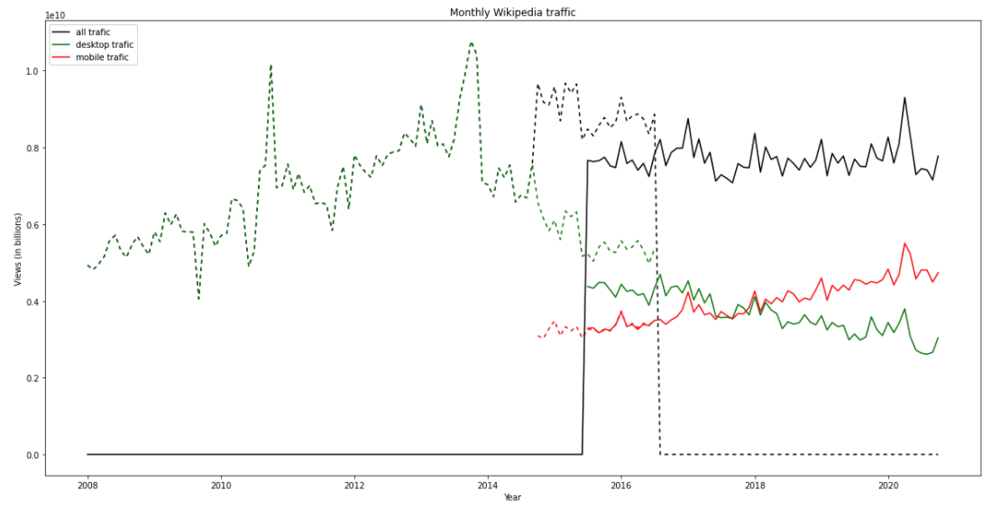

# Assignment 2
> **Date:** 15.11.2020 - 10:39 PM *(Due: 17.11.2020 - 03:00 PM)*  
> **Name:** `arro` Arne Rolf 
> **Session:** [02 Exercise](https://github.com/FUB-HCC/hcds-winter-2020/wiki/02_exercise)   
----

## R2 - Reflection
> Book: The Practice of Reproducible Research (Chapter 2 and 3)

### Definitions
_Reproducibility and replicability_
_How does this relate to the definitions given in the lecture?_

### 🗨️&nbsp; "How does the reading inform your understanding of human centered data science?"  
_Describe in at least 2-3 full sentences._

### ❓&nbsp; Questions
_List at least 1 question (full sentence) that this reading raised in your mind, and say why._

1. ...

***

## A2 - Reproducibility Workflow
Retrieving the data from the REST API was quite easy. 
Working with the Pandas library turned out to save a lot of time compared to creating the required `.csv` file with just pure python. 
Describing then each step in a Jupiter notebook feels a bit like teaching someone how to code who has little knowledge in programming.

### Final Wikipedia Page View Plot

### Challenges
Most challenging for me was to turn the raw json data into one single correctly formatted pandas data frame. I still have to get used to work with pandas and all its possibilities.

_What was surprising, what did you learn?_ 😮
I found pandas syntax to work with Strings in a Series pretty neat.
